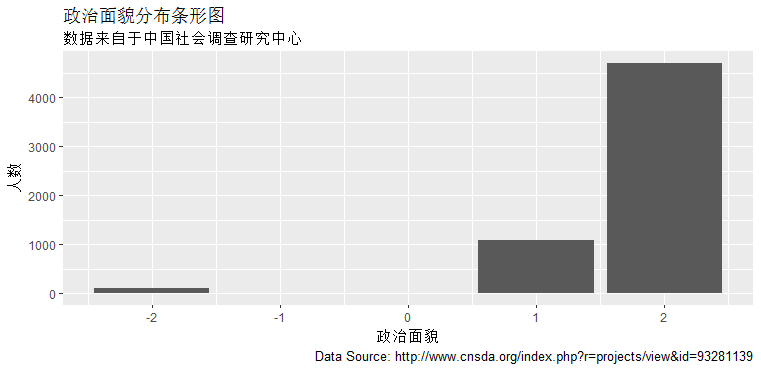

---

## 第一插入图片
这是我的第一次作业的截图。
```{r, echo=FALSE,out.width = "1000px"}
knitr::include_graphics("pic/zaza.png")
```
---

##第二导入数据
1. 该数据有5894个案例,694个变量
2. 调查数据中中共党员有4817人
3. 绘制图形

##第三绘制条形图
```{r, echo=FALSE,out.width = "1000px"}

```
